# Carte complete des parcours utilisateurs - PorteaPorte

Document de comprehension produit, cree apres audit. Objectif: voir l'ensemble de la plateforme en un seul endroit, sans modifier le fonctionnement du site.

## Lecture rapide

PorteaPorte pivote vers le covoiturage en premier. Les colis et l'impact restent presents, mais en soutien.

Flux dominant:

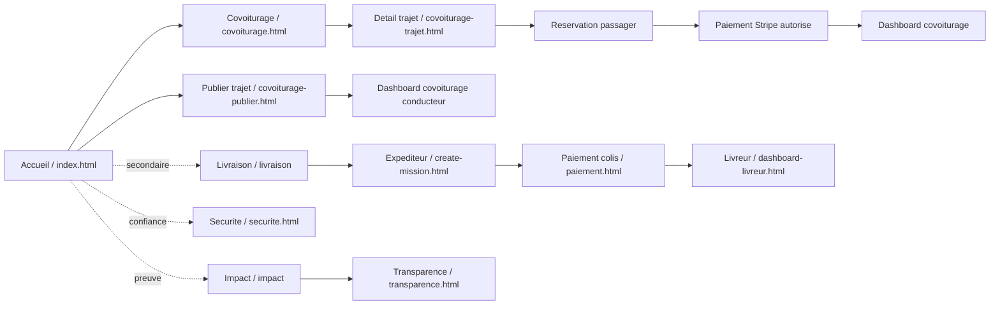

## Carte des roles

| Role | Objectif principal | Pages d'entree | Dashboard | APIs critiques |
|---|---|---|---|---|
| Visiteur | Comprendre, chercher, choisir | `index.html`, `covoiturage.html`, `livraison`, `impact`, `securite.html` | Aucun | `ride-search`, `ride-settings`, `impact-public` |
| Passager | Trouver et reserver un trajet | `covoiturage.html`, `covoiturage-trajet.html` | `dashboard-covoiturage.html` | `ride-search`, `ride-detail`, `ride-book`, `ride-payment-create`, `ride-payment-sync` |
| Conducteur | Publier un trajet et gerer reservations | `covoiturage-publier.html` | `dashboard-covoiturage.html` | `ride-create`, `ride-driver-profile`, `cov-dashboard`, `safe-meeting-points` |
| Expediteur | Creer un colis et payer en escrow | `livraison`, `expediteur.html`, `create-mission.html` | `dashboard-expediteur.html` | `price-estimate`, `create-livraison`, `my-livraisons`, `paiement-livraison`, `cancel-livraison` |
| Livreur | Accepter, livrer, prouver | `browse-missions.html`, `dashboard-livreur.html` | `dashboard-livreur.html` | `available-livraisons`, `assign-driver`, `my-driver-livraisons`, `livraison-pickup`, `confirm-delivery`, `capture-livraison` |
| Administrateur | Superviser, arbitrer, proteger | `admin/dashboard-admin.html` | `admin/dashboard-admin.html` | `admin-dashboard`, `ride-admin`, `impact-admin`, `admin-disputes`, `refund-payment` |

## Parcours visiteur anonyme

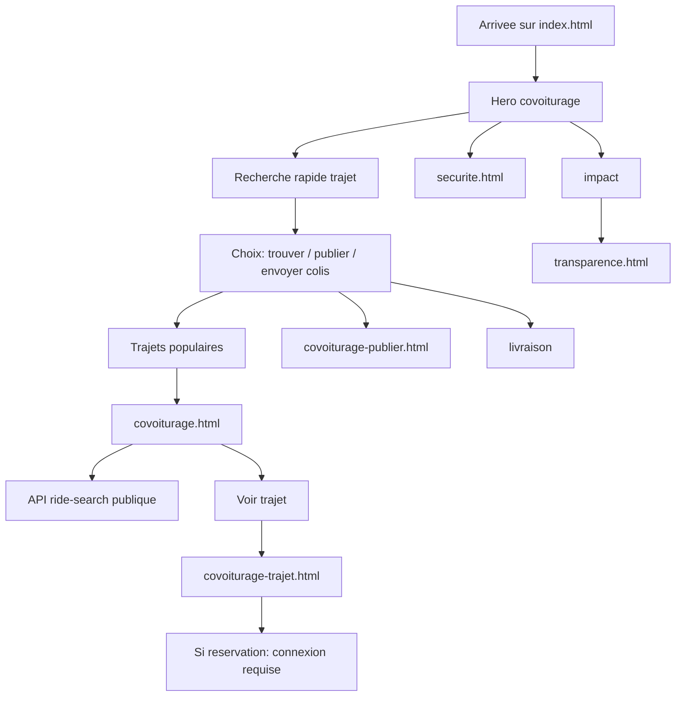

Ce parcours doit rester le plus simple du site. C'est celui qui transforme un visiteur Facebook en utilisateur.

## Parcours passager

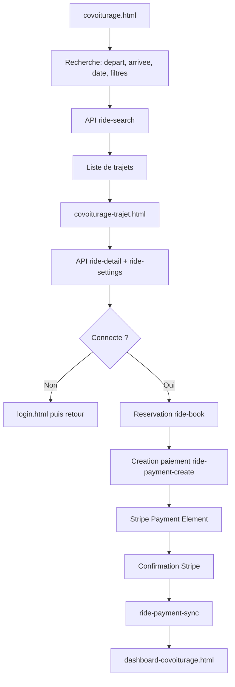

Points de confiance:

- Le passager voit le trajet avant de payer.
- Les donnees sensibles passent par session Supabase.
- Le paiement covoiturage utilise Stripe et une autorisation avant capture.

## Parcours conducteur covoiturage

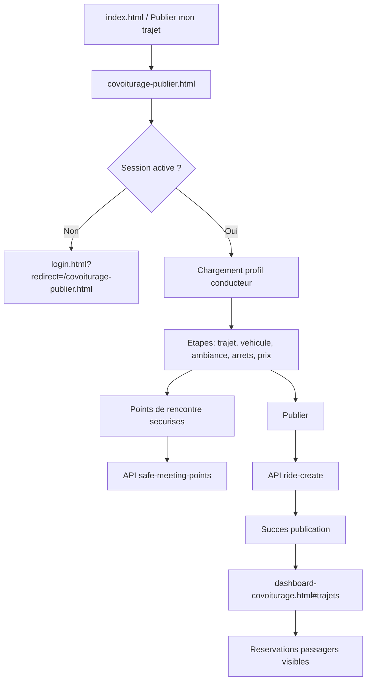

Points critiques:

- Ne jamais casser `ride-create`.
- Ne jamais rendre la publication possible sans session.
- Garder la verification du profil conducteur visible et rassurante.

## Parcours colis expediteur

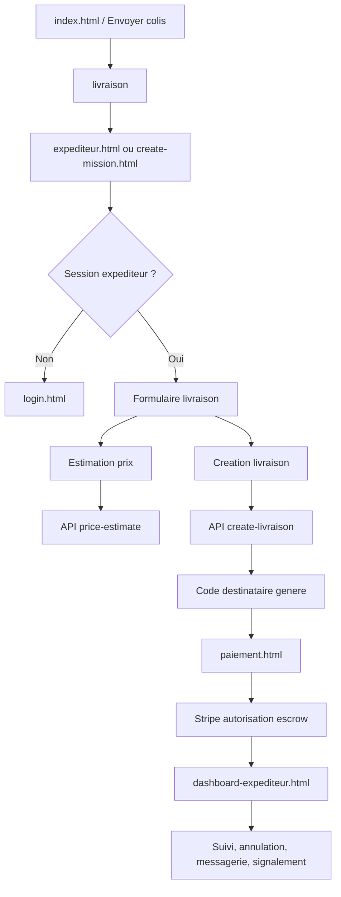

Role du colis dans le pivot:

- Secondaire sur la homepage.
- Toujours disponible pour monetiser les trajets.
- Ne doit pas dominer visuellement le covoiturage.

## Parcours livreur / conducteur colis

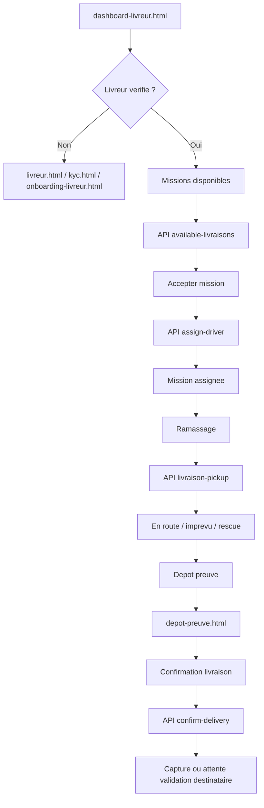

Surfaces liees:

- `browse-missions.html`
- `dashboard-livreur.html`
- `suivi-livraison.html`
- `depot-preuve.html`
- `messagerie.html`
- `livreur-card.html`

## Parcours administrateur

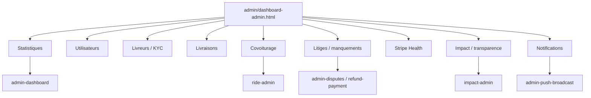

Regle produit:

L'admin peut etre visible comme page HTML, mais les donnees et actions doivent rester bloquees par API si l'utilisateur n'est pas admin.

## Paiement covoiturage

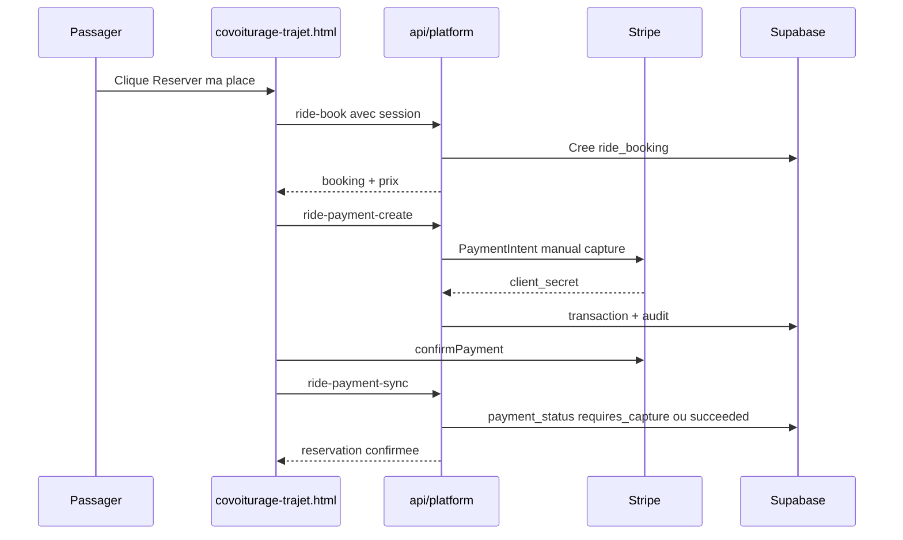

Ce qui protege l'utilisateur:

- Auth requise avant reservation.
- Stripe gere la carte.
- Statut de paiement synchronise cote serveur.
- Tests automatises couvrent `ridePaymentCreate` et `ridePaymentSync`.

## Paiement colis

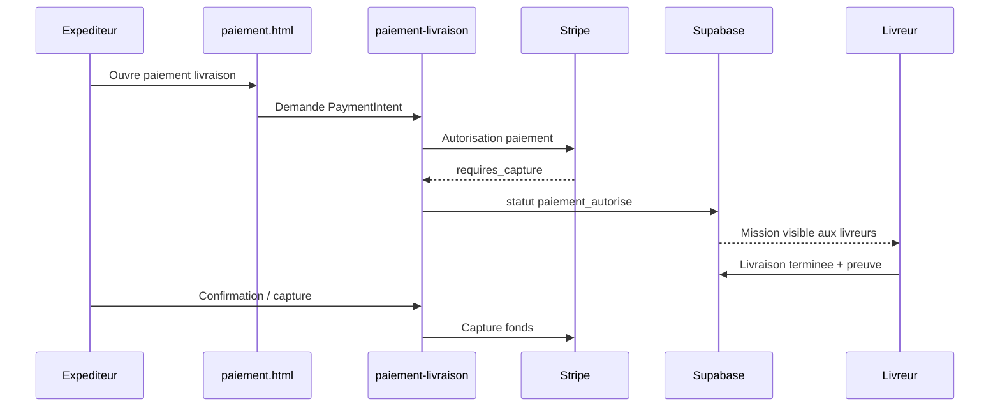

Ce qui protege l'utilisateur:

- Le colis n'est visible aux livreurs qu'apres paiement autorise.
- La capture est separee de l'autorisation.
- Les tests couvrent les cas 401, 403, 404, 409 et `requires_capture`.

## Pages par domaine

### Covoiturage

- `index.html`: entree principale, covoiturage dominant.
- `covoiturage.html`: recherche et resultats.
- `covoiturage-trajet.html`: detail, reservation passager, option colis.
- `covoiturage-publier.html`: publication conducteur.
- `dashboard-covoiturage.html`: trajets publies, reservations, missions.
- `covoiturage-info.html` et `covoiturage/regles.html`: explication et regles.

### Colis / livraison

- `livraison`: page secondaire courte.
- `expediteur.html`: entree expediteur complete.
- `create-mission.html`: creation livraison.
- `paiement.html`: paiement escrow colis.
- `dashboard-expediteur.html`: suivi expediteur.
- `dashboard-livreur.html`: execution livreur.
- `browse-missions.html`: missions disponibles.
- `suivi-livraison.html`, `suivi.html`, `map.html`: suivi.
- `depot-preuve.html`: preuve de depot.

### Confiance

- `securite.html`: page centrale de confiance.
- `assurance.html`: protection colis.
- `cgu.html`, `cgv.html`, `confidentialite.html`: legal.
- `contact.html`, `faq.html`, `status.html`: support.
- `transparence.html`, `impact`: preuve impact.

### Compte et verification

- `signup.html`: inscription.
- `login.html`: connexion, reset, OTP/OAuth.
- `role-choice.html`: choix de role.
- `profile.html`, `compte.html`, `mes-donnees.html`: profil et donnees.
- `livreur.html`, `kyc.html`, `onboarding-livreur.html`: verification livreur.

### Admin

- `admin/dashboard-admin.html`: centre operations.
- `admin/operations.html`: operations live.
- `admin/stripe-health.html`: sante Stripe.
- `admin/diagnostic.html`: diagnostic.
- `admin/users.html`: utilisateurs.
- `admin/kyc-review.html`: verification KYC.
- `admin/manquements.html`: arbitrage.
- `admin/analytics.html`, `admin/analytics-recherches.html`: analytics.
- `admin/parametres.html`: parametres financiers.
- `admin/backup.html`: backup/export.

## APIs critiques

| Domaine | Endpoint | Role |
|---|---|---|
| Covoiturage | `ride-search` | Recherche publique |
| Covoiturage | `ride-detail` | Detail public / prive selon role |
| Covoiturage | `ride-create` | Publication conducteur |
| Covoiturage | `ride-book` | Reservation passager |
| Covoiturage | `ride-payment-create` | Creation paiement covoiturage |
| Covoiturage | `ride-payment-sync` | Synchronisation Stripe |
| Covoiturage | `cov-dashboard` | Dashboard covoiturage |
| Covoiturage | `ride-driver-profile` | Profil conducteur (vehicule, ambiance, photos) |
| Covoiturage | `ride-vehicle-photo` | Upload / suppression photos de voiture |
| Covoiturage | `cov-progress` | Progression missions + recompenses vertes (XP, badges) |
| Livraison | `price-estimate` | Estimation prix |
| Livraison | `create-livraison` | Creation colis |
| Livraison | `paiement-livraison` | Paiement colis |
| Livraison | `available-livraisons` | Missions disponibles |
| Livraison | `assign-driver` | Acceptation livreur |
| Livraison | `my-livraisons` | Dashboard expediteur |
| Livraison | `my-driver-livraisons` | Dashboard livreur |
| Livraison | `confirm-delivery` | Confirmation livraison |
| Livraison | `capture-livraison` | Capture paiement |
| Securite | `turnstile-verify` | Anti-abus formulaire |
| Admin | `admin-dashboard` | Donnees admin |
| Admin | `ride-admin` | Supervision covoiturage |
| Admin | `refund-payment` | Remboursements |
| Impact | `impact-public` | Donnees publiques |
| Impact | `impact-admin` | Administration impact |

## Ajouts recents (croissance et equite covoiturage)

Ces fonctions ont ete ajoutees apres l'audit initial. Elles ne modifient pas les flux critiques (publication, reservation, paiement) ; elles s'ajoutent par-dessus.

### 1. Tarification covoiturage equitable et legale

- Le cout est divise par le nombre d'occupants (`total_seats` + 1 conducteur) pour rester du partage de frais, jamais du profit (legal au Quebec).
- Le tarif/km suggere s'ajuste selon l'energie du vehicule (`energy_type`: electrique, hybride, essence, diesel), avec un plafond par energie (anti-triche).
- Colonnes Supabase ajoutees: `rides.total_seats`, `rides.energy_type`.

### 2. Recompenses conducteurs verts (gamification, prix passager inchange)

Recompense gradue selon l'energie, jamais via le prix (sinon covoiturage illegal):

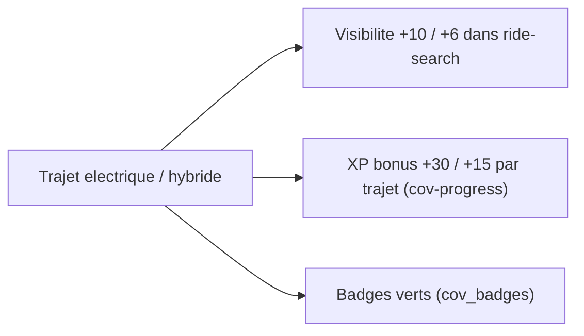

- Visibilite: bonus de classement gradue dans `ride-search` (electrique > hybride).
- XP: bonus accorde a la completion d'un trajet vert via `cov-progress` (lu cote serveur sur `energy_type`, anti-triche).
- Badges: `conducteur_vert_or` (electrique) et `conducteur_vert_argent` (hybride), seed SQL `sql-migration-badges-verts.sql`.

### 3. Carte partageable (croissance Facebook / Messenger)

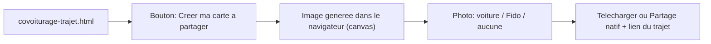

- 100% cote navigateur (canvas), aucun stockage serveur, aucune moderation requise.
- Reutilise la photo de voiture du profil si presente, sinon photo choisie sur l'appareil.
- Affiche le badge vert si le trajet est electrique / hybride.

### 4. Photos de voiture (profil conducteur)

- Upload / suppression via `ride-vehicle-photo` (bucket public `profile-photos`, alerte admin a chaque ajout).
- Stockees dans `ride_driver_profiles.vehicle_photos` (max 6), compressees cote navigateur avant envoi.
- UI dans `covoiturage-publier.html` (Etape 2 vehicule).
- Correctif inclus: la route `ride-driver-profile` ne passait pas le `body` (la sauvegarde POST du profil etait cassee).

## Etat de confiance apres audit

Ce qui est sain:

- Les pages publiques principales repondent en 200.
- Les APIs sensibles testees sans session retournent 401.
- Les tests automatises existants passent.
- Le paiement covoiturage et colis sont couverts par tests serveur.
- Les headers de securite live sont presents: HSTS, CSP, X-Frame-Options, Referrer-Policy.

Ce qui reste a surveiller:

- Ne pas diluer le message covoiturage avec trop de blocs colis.
- Ne pas exposer des promesses de securite plus fortes que la realite operationnelle.
- Garder les images legeres sur les pages d'entree.
- Tester en vrai navigateur mobile avant campagne Facebook.
- Tester les parcours authentifies avec comptes beta dedies avant lancement public.

## Ce qui ne doit jamais casser

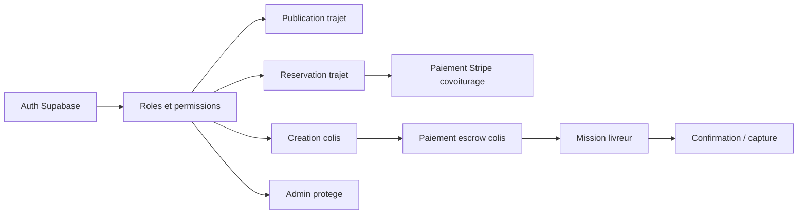

Elements a proteger en priorite:

- Authentification et verification email.
- Role utilisateur: passager, conducteur, expediteur, livreur, admin.
- `ride-create`, `ride-book`, `ride-payment-create`, `ride-payment-sync`.
- `create-livraison`, `paiement-livraison`, `capture-livraison`.
- Dashboards utilisateur et admin.
- Pages legales et securite.

## Priorites produit

P1:

- Garder les APIs sensibles protegees.
- Garder Stripe coherent entre UI, serveur et webhooks.
- Ne jamais publier une mission colis sans paiement autorise.
- Ne jamais permettre reservation/publication sans session valide.

P2:

- Simplifier encore la lecture du parcours covoiturage.
- Verifier les parcours authentifies avec comptes beta.
- Garder les pages legales sans 404.
- Continuer l'optimisation mobile.

P3:

- Ajouter une version visuelle interactive plus tard.
- Ajouter des captures d'ecran par parcours.
- Ajouter une checklist de test par role.

